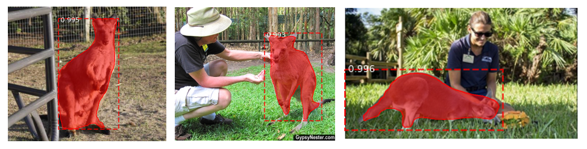
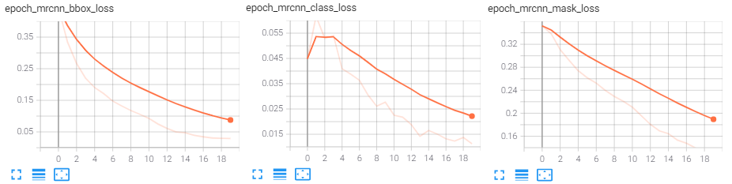

# Mask R-CNN for Object Detection and Segmentation

This is an implementation of [Mask R-CNN](https://arxiv.org/abs/1703.06870) from [matterport](https://github.com/matterport/Mask_RCNN) made compatible with Python 3.8 and TensorFlow 2.x. The model generates bounding boxes and segmentation masks for each instance of an object in the image. It's based on Feature Pyramid Network (FPN) and a ResNet backbone.


### Dataset
The kangaroo dataset can be downloaded from [here](https://github.com/Vidya1899/Kangaroo_dataset) which is a subset of the kangaroo dataset from [expereiencor](https://github.com/experiencor/kangaroo) but with cocojson annotations instead of xml.    
Annotation tool used: VIA tool (Can be downloaded from : https://www.robots.ox.ac.uk/~vgg/software/via/)

### Requirements    
Python 3.8, Tensorflow 2.4.1, Keras 2.4.3 and other common packages listed in `requirements.txt`.    

### Installation    
1. Clone this repository    
2. Install dependencies    
   ```bash
   pip3 install -r requirements.txt
   ```
3. Run setup from the repository root directory    
    ```bash
    python3 setup.py install
    ``` 
3. Download pre-trained COCO weights (mask_rcnn_coco.h5) from the [releases page](https://github.com/matterport/Mask_RCNN/releases).    

### Expected dataset structure after annotating data using [VIA tool](https://www.robots.ox.ac.uk/~vgg/software/via/)
```
Dataset/    
  train/    
    images
    coco_train.json   
  val/
    images
    coco_val.json
```
### Logging to TensorBoard
The model is configured to log losses and save weights at the end of every epoch for visualisation.


### Citation
Use this bibtex to cite this repository:    
```
@misc{matterport_maskrcnn_2017,
  title={Mask R-CNN for object detection and instance segmentation on Keras and TensorFlow},
  author={Waleed Abdulla},
  year={2017},
  publisher={Github},
  journal={GitHub repository},
  howpublished={\url{https://github.com/matterport/Mask_RCNN}},
}
```
